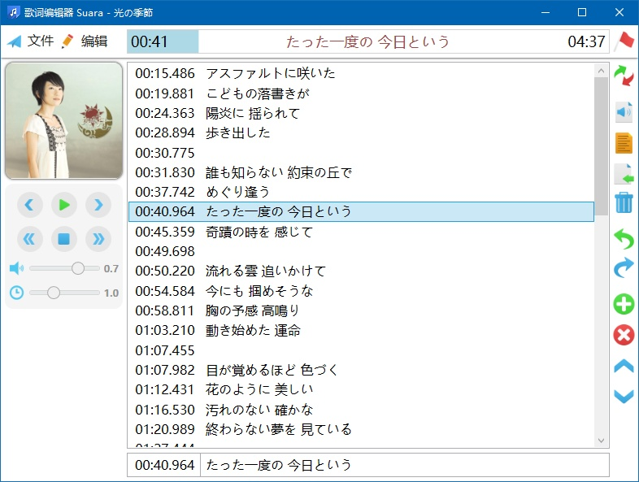

# LyricEditor

A much modified lyric editor with fancy (maybe) UI. Written in `C# 7.0`, `WPF`, `.NET Framework 4.8`. Downward compatible to `Windows 7` with `.NET Framework 4` or newer version installed. 

If you want to compile the source code, please use at least Visual Studio 2017 because I was using new features in `C# 7.0` such as:

```C#
int.TryParse(string input, out int output)
```
The current UI is shown below. Only Chinese version is provided.


# 歌词制作器

一个优化了界面的歌词制作器，使用 `C# 7.0`，`WPF`，`.NET Framework 4.8` 制作。向下兼容至 `Windows 7`。

> [!note]
> 本软件使用 Windows Media Player 播放音频。如果发现无法播放媒体文件，请在「Windows 功能」中开启相关功能。
> 

知乎链接：[歌词制作器 LyricEditor 第二版发布及使用说明](https://zhuanlan.zhihu.com/p/32588196)
